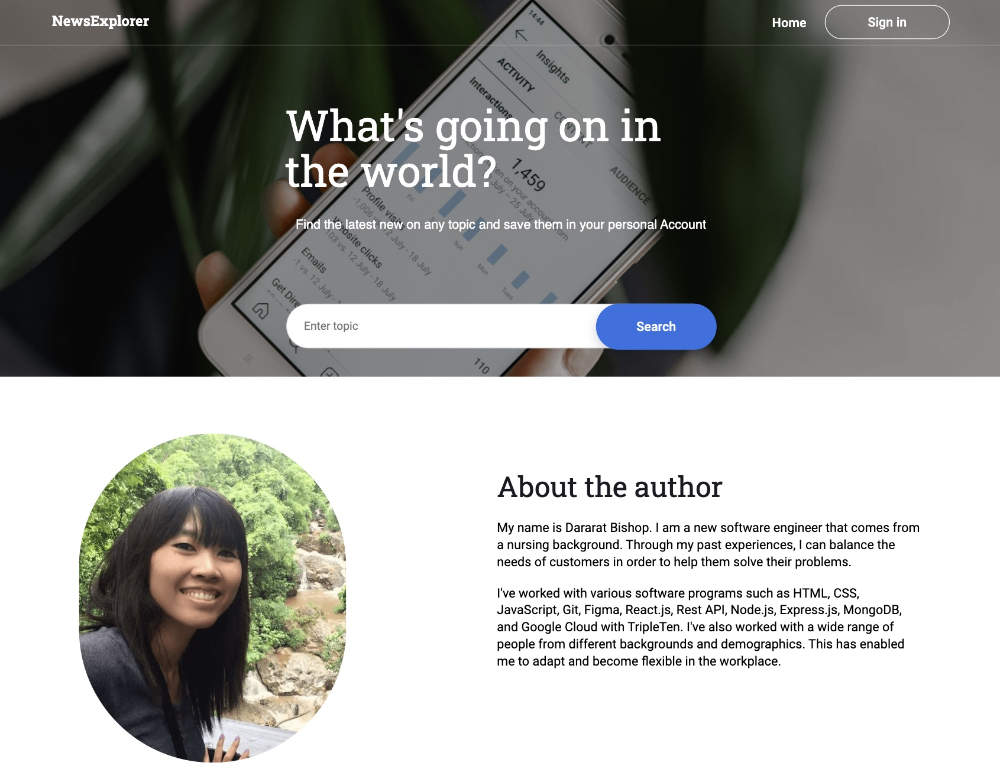
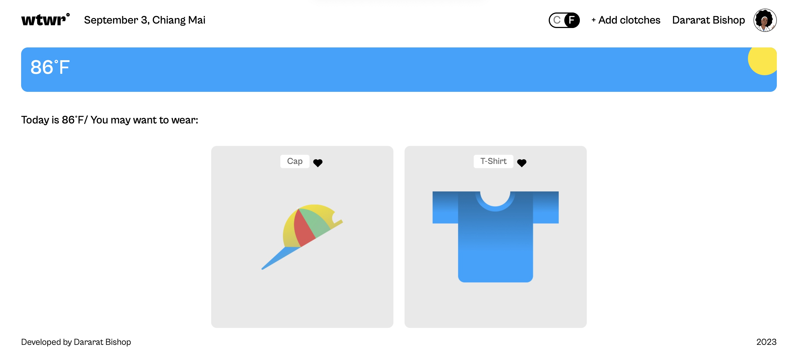

### Hi there 👋, I'm Dararat Bishop.
I am a proficient full-stack software engineer with a background in nursing. Seeking career opportunities in software engineering to help companies develop responsive, scalable, and practical web experiences. My previous experience in the healthcare industry has equipped me with the skills necessary such as planning, implementation, and evaluation using critical thinking skills to balance customer needs and assist them in finding solutions to their issues effectively. I also have worked with individuals from diverse backgrounds and demographics, which has helped me become flexible and adaptable in the workplace.

## I'm a Software Engineer.

|       | 👋 Hi there |
| ----------- | ----------- |
| 🔭 About me :| I'm a newly graduated Software Engineer from TripleTen. I am an enthusiastic and firmly believe that every experience in life provides an opportunity to learn and grow.  | 
| 🌱 Tech experiences: | HTML, CSS, JavaScript, React, and Express.       |
| ⚡ Fun fact: | I was a nurse who worked in the healthcare industry for 7 years. I love to cook and spend time with friends and family.|
| 🌟 Featured Projects: | [<kbd><kbd>](https://newsexplorer.servernux.com/) &nbsp;&nbsp;&nbsp;[<kbd><kbd>](https://www.wtwr.twilightparadox.com/)|
| 💬 Ask me about My projects?| 
| 📫 How to reach me:| **email:** dararat246@gmail.com **social:** https://www.linkedin.com/in/dararat-bishop-45101288/|

